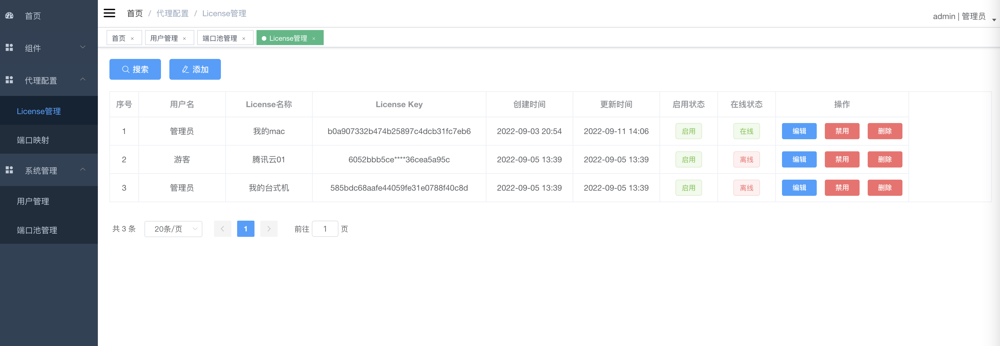

# 1、简介
中微子代理（neutrino-proxy）是一个基于netty的、开源的java内网穿透项目。遵循MIT许可，因此您可以对它进行复制、修改、传播并用于任何个人或商业行为。

# 2、名称由来
中微子，是轻子的一种，是组成自然界的最基本的粒子之一。它十分微小、不带电，可自由穿过地球，以接近光速运动，与其他物质的相互作用十分微弱，号称宇宙间的“隐身人”。

中微子是宇宙中穿透能力最强的物质,只有粒子之间的间隙小于10的负19次方米时,才能够阻挡住中微子。

因此以中微子命名，寓意着中微子代理拥有中微子"安全"、"快速"、"穿透力强"的特点。

# 3、运行示例





# 4、项目结构
- neutrino-proxy 
    - neutrino-core     与代理无关的基础封装
    - neutrino-proxy-core       与代理相关的公共常量、编解码器
    - neutrino-proxy-client     代理客户端项目
    - neutrino-proxy-server     代理服务端项目
    - neutrino-proxy-admin      代理监控项目（基于vue-element-admin开发）

# 5、运行
## 5.1、使用keytool工具生成ssl证书, 若不需要ssl加密可跳过
```shell
keytool -genkey -alias test1 -keyalg RSA -keysize 1024 -validity 3650 -keypass 123456 -storepass 123456 -keystore  "./test.jks"
```

## 5.2、修改服务端配置（application.yml）
```yml
application:
  name: neutrino-proxy-server

proxy:
  protocol:
    max-frame-length: 2097152
    length-field-offset: 0
    length-field-length: 4
    initial-bytes-to-strip: 0
    length-adjustment: 0
    read-idle-time: 60
    write-idle-time: 40
    all-idle-time-seconds: 0
  server:
    # 服务端端口，用于保持与客户端的连接，非SSL
    port: 9000    
    # 服务端端口，用于保持与客户端的连接，SSL,需要jks证书文件，若不需要ssl支持，可不配置
    ssl-port: 9002
    # 证书密码
    key-store-password: 123456
    key-manager-password: 123456
    # 证书存放路径，若不想打进jar包，可不带classpath:前缀
    jks-path: classpath:/test.jks 
  data:
    # 数据库配置（不用动，项目自动会自动初始化）
    sqlite:
      url: jdbc:sqlite:data.db
      driver-class: org.sqlite.JDBC
```

## 5.3、启动服务端
> fun.asgc.neutrino.proxy.server.ProxyServer

## 5.4、修改客户端配置
```yml
application:
  name: neutrino-proxy-client

proxy:
  protocol:
    max-frame-length: 2097152
    length-field-offset: 0
    length-field-length: 4
    initial-bytes-to-strip: 0
    length-adjustment: 0
    read-idle-time: 60
    write-idle-time: 30
    all-idle-time-seconds: 0
  client:
    # ssl证书密码
    key-store-password: 123456
    # ssl证书存放位置
    jks-path: classpath:/test.jks
    # 服务端ip，若部署到服务器，则配置服务器的ip
    server-ip: localhost
    # 服务端端口，若使用ssl，则需要配置为服务端的"ssl-port"
    server-port: 9000
    # 是否启用ssl，启用则必须配置ssl相关参数
    ssl-enable: false
    # 获取license提示间隔（秒）
    obtain-license-interval: 5
```

## 5.5、启动客户端
> fun.asgc.neutrino.proxy.client.ProxyClient
默认情况下，客户端会加载当前目录下的.neutrino-proxy.license里的license，可通过命令行参数指定，如：java -jar neutrino-proxy-client.jar license=xxx
若启动参数未指定license，且是首次启动（当前目录下未缓存license），则需要根据命令行提示输入正确的license, 输入完成后完成连接，可在服务端管理页面控制端口转发，参见[2、运行示例](#2)

# 6、演示环境
> 可使用分配好的游客license试用。服务器带宽较低，仅供学习使用！
- 管理后台地址：http://103.163.47.16:9527
- 游客账号：visitor/123456

# 7、未来迭代方向
- 优化代码、增强稳定性
- 服务端增加管理页面，提供报表、授权、限流等功能
- 从项目中分离、孵化出另一个开源项目(neutrino-framework)

# 8、技术文档
- [Aop](./docs/Aop.MD)
- [Channel](./docs/Channel.MD)

# 9、联系我们
- 微信: yuyunshize
- Gitee: https://gitee.com/asgc/neutrino-proxy

# 10、特别鸣谢
* [JetBrains](https://www.jetbrains.com?from=RedisFront)

